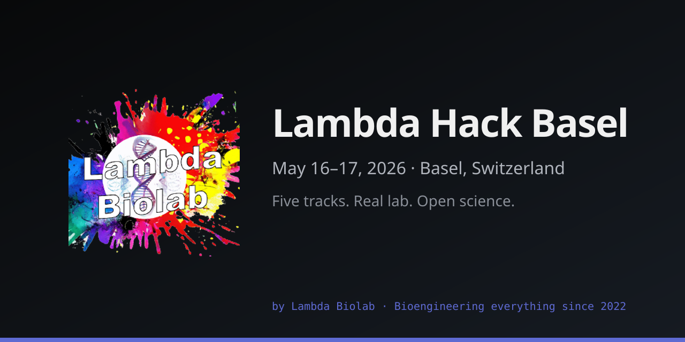

# Lambda Hack Basel



Website for **Lambda Hack Basel** — a scrappy hackathon at the intersection of biology, computation, hardware, and everything else. May 16–17, 2026. By [Lambda Biolab](https://www.lambconsulting.bio).

Live: **[hack-basel.lambdabiolab.com](https://hack-basel.lambdabiolab.com/)**

## Stack

- Next.js 16 (App Router, static export)
- React 19, TypeScript (strict + `noUncheckedIndexedAccess`)
- Tailwind CSS 4
- Leaflet (lazy-loaded for the location map)
- Deployed to GitHub Pages via [`actions/deploy-pages`](https://github.com/actions/deploy-pages)

## Develop

```bash
pnpm install
pnpm dev        # http://localhost:3000
```

## Build

```bash
pnpm lint
pnpm exec tsc --noEmit
pnpm build                        # static export under out/
pnpm verify:build                 # 19-check acceptance contract on out/
```

`next.config.ts` sets `output: "export"` unconditionally — the only deploy target is GitHub Pages. The site serves from the custom domain `hack-basel.lambdabiolab.com` at the origin root (no `basePath`). [`public/CNAME`](./public/CNAME) pins the custom-domain setting across deploys; GitHub strips it otherwise. Site metadata (URLs, event, venue, org, contact) has a single source of truth at [`src/config/site.ts`](./src/config/site.ts).

## Maintenance

```bash
pnpm lint:md             # markdownlint on all .md
pnpm lint:md:fix         # auto-fix markdownlint findings
pnpm lint:links          # lychee link check on all .md
pnpm optimize:photos     # re-encode public/photos to WebP via sharp
pnpm generate:og         # regenerate og-image.png + .github/social-preview.png
pnpm audit --prod --audit-level high   # security audit (runs in CI)
```

See [`scripts/README.md`](./scripts/README.md) for the full script inventory and the optional [`claude-seo`](https://github.com/AgriciDaniel/claude-seo) audit installer.

## Layout

```text
src/
  app/
    layout.tsx        # root: metadata, CSP, JSON-LD, pre-hydration theme script
    page.tsx          # home (composes all sections)
    globals.css       # Tailwind entry + design tokens
    icon.png          # Lambda Biolab avatar → favicon (Next convention)
    robots.ts         # emits /robots.txt (static export)
    sitemap.ts        # emits /sitemap.xml (static export)
  components/
    Nav, Hero, Tracks, LabStrip, Schedule, ResultsRound,
    Location, Rules, Register, Footer
    icons.tsx         # shared brand + generic SVG icons
  config/
    site.ts           # URL, event, venue, org, contact — single source of truth
  lib/
    useIsDark.ts      # theme hook shared by Hero + Location
public/
  CNAME               # pins hack-basel.lambdabiolab.com
  og-image.png        # 1200×630 OG/Twitter card
  llms.txt            # AI-crawler content guidance
  photos/             # event imagery (WebP; see PHOTOS.md)
  tracks/             # track card icons
scripts/
  optimize-photos.mjs       # sharp photo pipeline
  generate-og.mjs           # OG card + GitHub social preview
  verify-build.mjs          # post-build acceptance contract
  install-claude-seo.sh     # optional SEO audit plugin installer
  uninstall-claude-seo.sh
  README.md                 # inventory + pnpm-script mapping
```

## Design

See [`DESIGN.md`](./DESIGN.md) for the design system (Linear-inspired; system light/dark; brand accent `#5e6ad2`).

## Contributing

- **Technical workflow**: [`CONTRIBUTING.md`](./CONTRIBUTING.md) covers setup, pre-PR checks, code patterns, conventional-commit style, and release flow. Single authoritative source — other pointers here defer to it.
- **AI-agent behaviour**: [`AGENTS.md`](./AGENTS.md). Session-loaded rules in [`.claude/rules/`](./.claude/rules/).
- **License**: site code MIT ([`LICENSE`](./LICENSE)). Photos under `public/photos/` have separate terms — see [`PHOTOS.md`](./PHOTOS.md). Forks: supply your own imagery.

## Deployment

Two workflows cover the lifecycle:

- [`.github/workflows/ci.yml`](./.github/workflows/ci.yml) — runs on every pull request and push to `main`: `tsc --noEmit`, `pnpm lint`, `pnpm lint:md`, `pnpm audit --prod --audit-level high`, `pnpm build`, `pnpm verify:build`, and lychee link check via `lycheeverse/lychee-action`.
- [`.github/workflows/deploy.yml`](./.github/workflows/deploy.yml) — runs on push to `main` (and `workflow_dispatch` from any branch): builds and publishes via GitHub Pages (workflow-mode deploy).

## Changelog

Release history and notable changes: [`CHANGELOG.md`](./CHANGELOG.md) (Keep-a-Changelog + SemVer).
